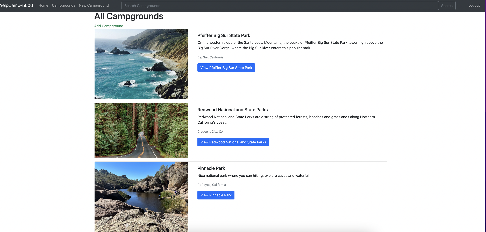
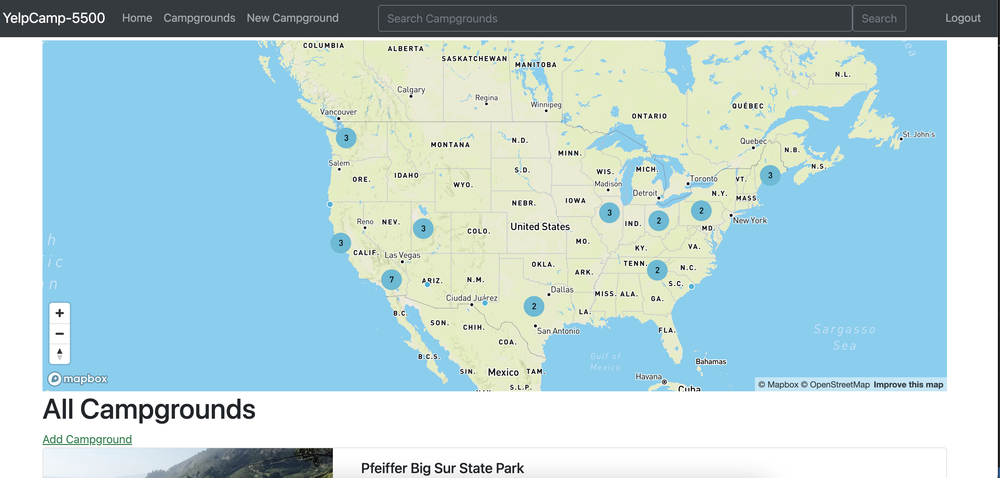
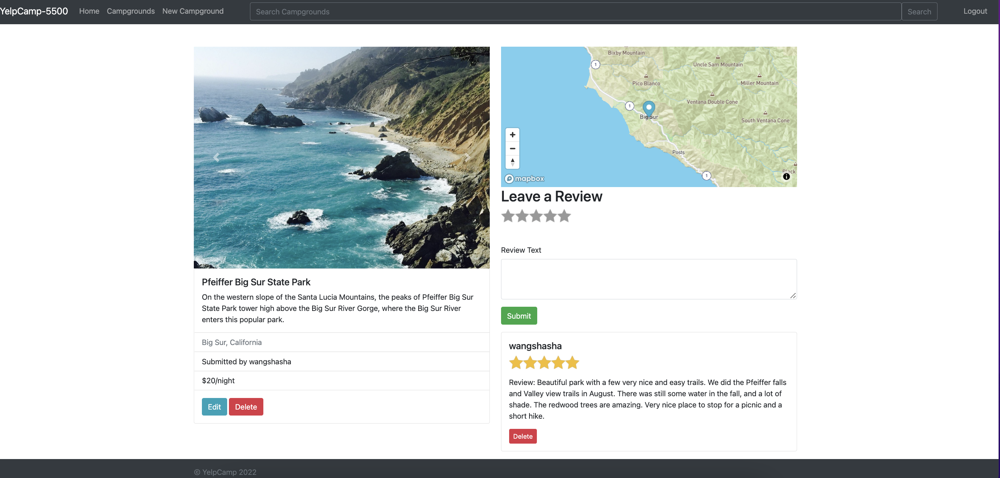
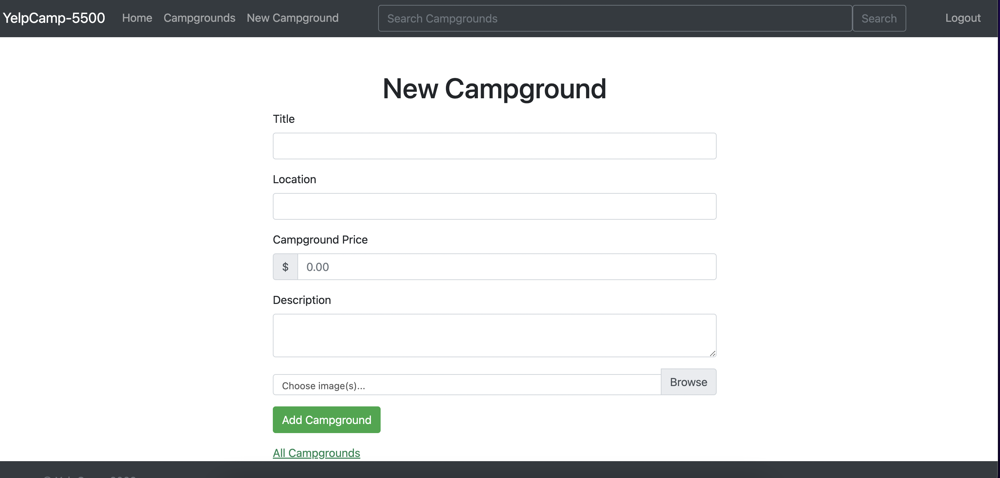
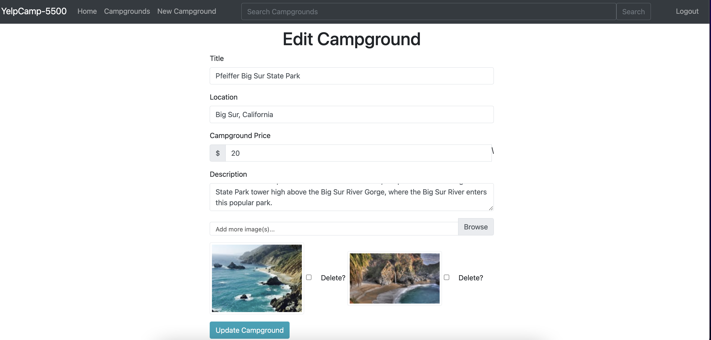

# yelp-camp-cs5500

Heroku: https://blooming-escarpment-35978.herokuapp.com/  

Group Project team members: Shasha Wang, Xingzhi Chen, Xiaoliang Xu, Cheng Xue and Yingqi Zhang.  

## Homepage

YelpCamp-5500 is a website where users can access campground information, create and review campgrounds.

The website includes the campground title, location, estimated price, traveler description, images, and reviews.

Users can search for campground information by entering the campground name in the search bar.

By logging in, users can access & edit their personal campgrounds and reviews.

Users are welcome to update new campground information to fulfill the website's content.

Users can rate and leave reviews under existing campground posts to interact with the user community. 

## Register Page

## Campground Index Page

## Campgrounds Cluster Map

## Campground Page

## Create a New Campground

## Edit a Campground 

## Logout

